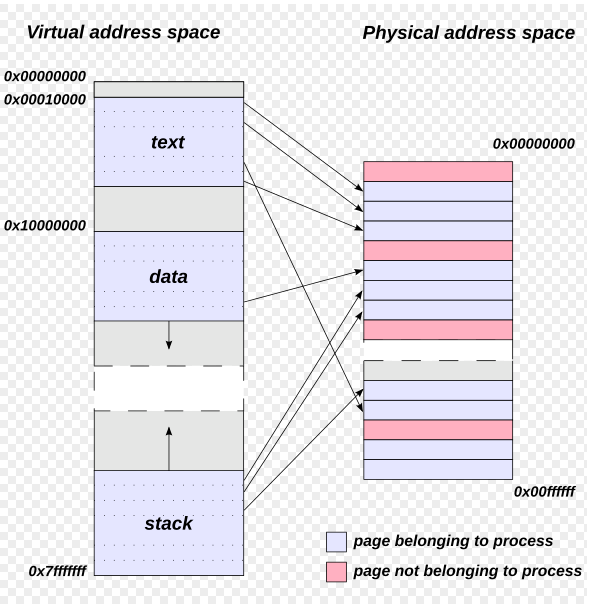
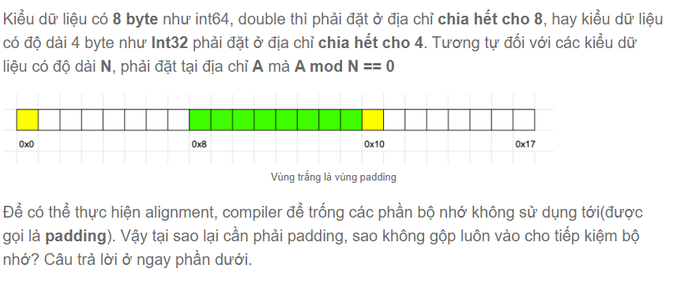
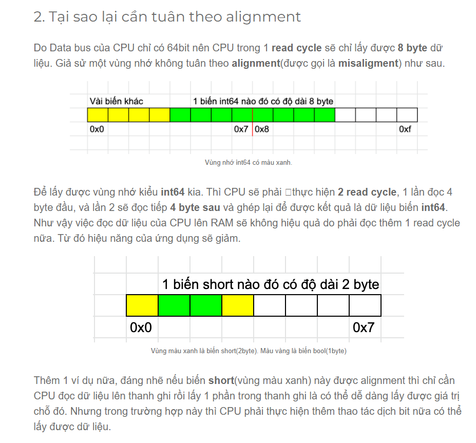

# WEEK 2
## [Lý thuyết]
### Virtual Address Space (VAS)
- [Wiki](https://en.wikipedia.org/wiki/Virtual_address_space) 
- [Geeskforgeeks](https://www.geeksforgeeks.org/virtual-address-space-in-operating-system/)
- `VAS or address space` là tập hợp các địa chỉ ảo mà hệ điều hành cung cấp cho một process. Phạm vi địa chỉ ảo thường bắt đầu ở địa chỉ thấp và có thể mở rộng đến địa chỉ cao nhất được kiến ​​trúc tập lệnh của máy tính cho phép và được hỗ trợ bởi việc triển khai kích thước con trỏ của hệ điều hành, có thể là 4 byte cho 32 bit hoặc 8 byte cho 64-bit. phiên bản hệ điều hành bit. 
- 
- Không gian địa chỉ được chia thành nhiều vùng, mỗi vùng chứa một chức năng cụ thể. Mỗi process đều có bỗ nhớ ảo riêng biệt, lưu tất cả các địa chỉ của chúng. 
`Các thuật ngữ chính của VAS trong hệ điều hành`:
- `Page` : là một khối bộ nhớ có kích thước cố định được sử dụng để quản lý bộ nhớ ảo.
- `Code segment` : là một phần của địa chỉ ảo chứa các hướng dẫn thực thi của process
- `Data Segment` : là một phần của địa chỉ ảo chứa bộ nhớ được phân bổ và các biến tiến trình.
- `Page Table` : là cấu trúc dữ liệu mà hệ điều hành quản lý để theo dõi mối quan hệ giữa các trang ảo và khung bộ nhớ thực.
- `Page Fault` : là trường hợp trang được yêu cầu không có trong bộ nhớ vật lý.

### Address Translating: 
- Quản lý bộ nhớ dịch địa chỉ logic (sử dụng trong process) sang địa chỉ vật lý (sử dụng trong phần cứng), giúp ứng dụng có thể truy cập và lưu trữ dữ liệu trong bộ nhớ mà không cần biết địa chỉ vật lý thực tế.
  - `Địa chỉ logic (logical address)`: được tạo ra bởi CPU trong khi một chương trình đang hoạt động. Địa chỉ logic hay còn được gọi là địa chỉ ảo.
  - `Địa chỉ vật lý (physical address)`: nhận diện địa chỉ vật lí của dữ liệu trong một bộ nhớ. Địa chỉ vật lý hay còn được gọi là địa chỉ thực.

### Protection Attribute 
- chỉ các thuộc tính hoặc đặc điểm của một tài nguyên hoặc hệ thống, được thiết lập để bảo vệ và đảm bảo tính bảo mật của chúng. Các thuộc tính bảo vệ bao gồm: PAGE - EXECUTE - READ - WRITE

### Memory Alignment
- Memory alignment là nói về sự sắp xếp dữ liệu trong bộ nhớ. Ở đây cụ thể hơn là vùng nhớ của các biến trong Struct được đặt vào những địa chỉ như thế nào.


#### Tóm lại alignment sinh ra để:
- CPU Fetch dữ liệu từ RAM được hiệu quả hơn.
- Tốc độ lấy dữ liệu sẽ cải thiện so với không alignment

### Stack
[Wiki](https://vi.wikipedia.org/wiki/Ng%C4%83n_x%E1%BA%BFp)
### Heap
[Wiki](https://vi.wikipedia.org/wiki/%C4%90%E1%BB%91ng_(c%E1%BA%A5u_tr%C3%BAc_d%E1%BB%AF_li%E1%BB%87u))

## [Exercise]
```C++
#include<iostream>
#include<windows.h>
#include<string>
#include<vector>
using namespace std;
wstring QueryRegistryValue(HKEY hKey, const wstring& subKey, const wstring& valueName)
{
	HKEY hSubKey;
    if (RegOpenKeyExW(hKey, subKey.c_str(), 0, KEY_QUERY_VALUE, &hSubKey) == ERROR_SUCCESS) 
    {
        DWORD dataType;
        DWORD dataSize = 0;

        if (RegQueryValueExW(hSubKey, valueName.c_str(), NULL, &dataType, NULL, &dataSize) == ERROR_SUCCESS) 
        {
            if(dataType == REG_SZ || dataType == REG_EXPAND_SZ)
            {
                vector<wchar_t> buffer(dataSize / sizeof(wchar_t));
                if(RegQueryValueExW(hSubKey, valueName.c_str(), NULL, NULL, reinterpret_cast<LPBYTE>(buffer.data()), &dataSize) == ERROR_SUCCESS)
                {
                    return wstring(buffer.data());
                }
            }
            else if(dataType == REG_DWORD)
            {
                DWORD data;
                if(RegQueryValueExW(hSubKey, valueName.c_str(), NULL, NULL, reinterpret_cast<LPBYTE>(&data), &dataSize) == ERROR_SUCCESS)
                {
                    return to_wstring(data);
                }
            }
        }
        RegCloseKey(hSubKey);
    }
}
int main()
{
    wstring hostName = QueryRegistryValue(HKEY_LOCAL_MACHINE, L"SYSTEM\\CurrentControlSet\\Control\\ComputerName\\ActiveComputerName", L"ComputerName");
    wstring OSName = QueryRegistryValue(HKEY_LOCAL_MACHINE, L"SOFTWARE\\Microsoft\\Windows NT\\CurrentVersion", L"ProductName");
    wstring OSBType = QueryRegistryValue(HKEY_LOCAL_MACHINE, L"SOFTWARE\\Microsoft\\Windows NT\\CurrentVersion", L"CurrentType");
    wstring regOwner = QueryRegistryValue(HKEY_LOCAL_MACHINE, L"SOFTWARE\\Microsoft\\Windows NT\\CurrentVersion", L"RegisteredOwner");
    wstring productID = QueryRegistryValue(HKEY_LOCAL_MACHINE, L"SOFTWARE\\Microsoft\\Windows NT\\CurrentVersion", L"ProductId");
    wstring sysManu = QueryRegistryValue(HKEY_LOCAL_MACHINE, L"SYSTEM\\CurrentControlSet\\Control\\SystemInformation", L"SystemManufacturer");
    wstring sysModel = QueryRegistryValue(HKEY_LOCAL_MACHINE, L"SYSTEM\\CurrentControlSet\\Control\\SystemInformation", L"SystemProductName");
    wstring processorName = QueryRegistryValue(HKEY_LOCAL_MACHINE, L"HARDWARE\\DESCRIPTION\\System\\CentralProcessor\\0", L"ProcessorNameString");
    wstring BIOSVersion = QueryRegistryValue(HKEY_LOCAL_MACHINE, L"HARDWARE\\DESCRIPTION\\System\\BIOS", L"BIOSVersion");

    wcout << L"Host Name: " << hostName << endl;
    wcout << L"OS Name: " << OSName << endl;
    wcout << L"OS Build Type: " << OSBType << endl;
    wcout << L"Registered Owner: " << regOwner << endl;
    wcout << L"Product ID: " << productID << endl;
    wcout << L"System Manufacturer: " << sysManu << endl;
    wcout << L"System Model: " << sysModel << endl;
    wcout << L"Processor Name: " << processorName << endl;
    wcout << L"BIOS Version: " << BIOSVersion << endl;
}
```

```C++
#include<iostream>
#include<windows.h>
using namespace std;

void ListExecutableMemoryRegions(DWORD processID)
{
	HANDLE hProcess = OpenProcess(PROCESS_QUERY_INFORMATION | PROCESS_VM_READ, FALSE, processID);
	if(hProcess == NULL)
	{
		cout << "Failed to open process.\n";
	}

	SYSTEM_INFO systemInfo;
	GetSystemInfo(&systemInfo);

	MEMORY_BASIC_INFORMATION memoryInfo;
	LPVOID memoryAddress = systemInfo.lpMinimumApplicationAddress;
	while(memoryAddress < systemInfo.lpMaximumApplicationAddress)
	{
		if(VirtualQueryEx(hProcess, memoryAddress, &memoryInfo, sizeof(memoryInfo)))
		{
			if(memoryInfo.Protect == PAGE_EXECUTE_READWRITE)
			{
				cout << "Base Address: " << memoryInfo.BaseAddress << endl;
				cout << "Allocation Base: " << memoryInfo.AllocationBase << endl;
				cout << "Allocation Protect: " << memoryInfo.AllocationProtect << endl;
				cout << "State: " << memoryInfo.State << endl;
				cout << "Protect: " << memoryInfo.Protect << endl;
				cout << "Type: " << memoryInfo.Type << endl;
			}
			memoryAddress = static_cast<LPVOID>(static_cast<char*>(memoryAddress) + memoryInfo.RegionSize);
		} else {
			break;
		}
	}
	CloseHandle(hProcess);
}

int main()
{
	DWORD processID;
	cout << "Enter PID: ";
	cin >> processID;
	ListExecutableMemoryRegions(processID);
}
```

```Python
from pathlib import Path

def list_files_in_directory(directory):
    try:
        path = Path(directory)
        for item in path.iterdir():
            if item.is_file():
                print(f"File: {item.name}")
            elif item.is_dir():
                print(f"Directory: {item.name}")
    except Exception as e:
        print(f"Error: {e}")
directory_path = input("Nhập vào đường dẫn thư mục bạn muốn liệt kê: ")
list_files_in_directory(directory_path)

```